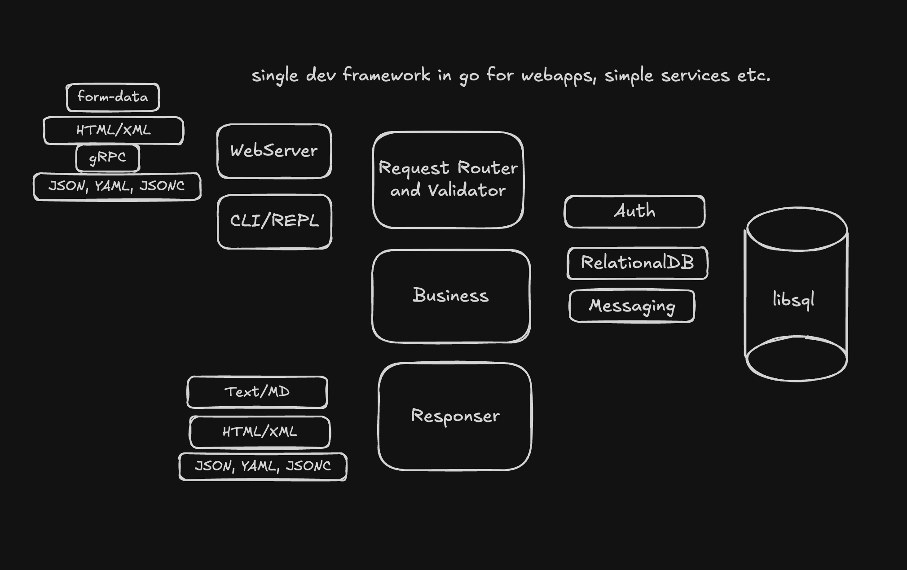

# Pizi

> WIP, just a toy.

A **Single Developer Framework** for Web Development, for Go developers.

I like the idea of Rails, Laravel and similar frameworks, but I also love the simplicity of Go.

I want to see how ard it is to build one of these frameworks, especially now
where a no-build JS stack is possible. (Thanks DHH for the talk!)

## Tech Stack For v0

- `libsql` for persistence
- `sqlc` for user queries
- `atlas` for schema and data migrations
- `valigo` for validation [on gh](https://github.com/Insei/valigo)
- `gorilla` for web [gorilla.github.io](https://gorilla.github.io/)
- `cobra` and `viper` for config [github.com/spf13/cobra](https://github.com/spf13/cobra)
- `bubblecharm` for tty
